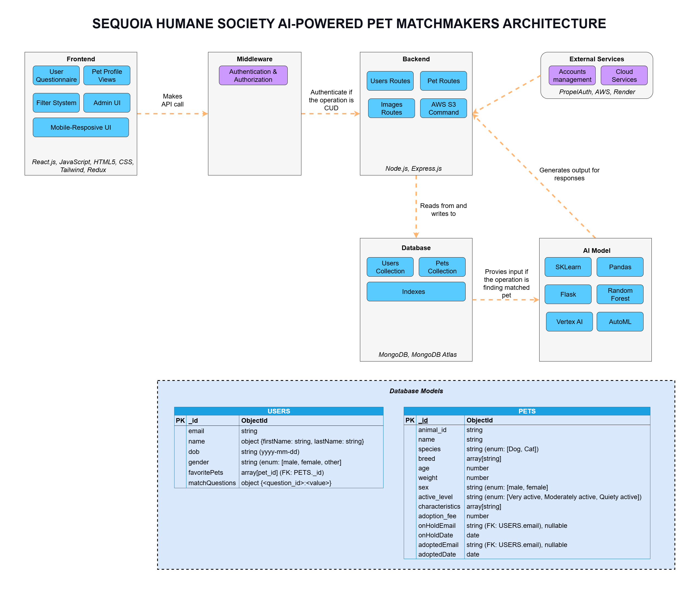
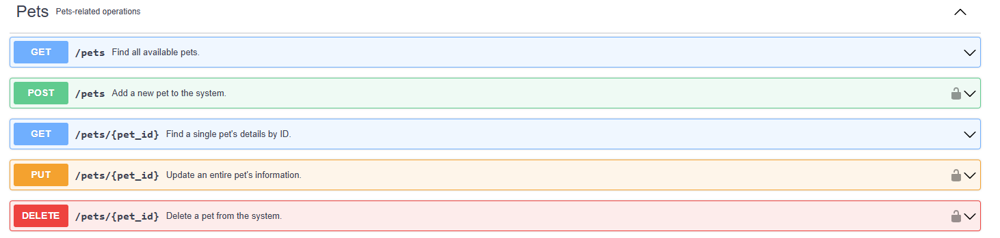

# Sequoia Humane Society AI-Powered Pet Matchmaker

## Quick Links

- Our [live server](https://propel-energy.org/)
- Check our [DevPost](https://devpost.com/software/ai-powered-pet-matchmaker-devilware)
- Nonprofit: [Sequoia Humane Society](https://ohack.dev/nonprofit/9ajAkAzo9rnb0IOmE4VY)
- [Official non-profit site](https://www.sequoiahumane.org/).
- [Hackathon Details](https://www.ohack.dev/hack/2025_summer)

<!-- ## Creator

@Faisal Alyousefi (on Slack) -->

## About the "Devilware"

**Our members**

- [Nghi H.](https://github.com/GittBitt)
- [Ngoc Dinh Khoa Nguyen](https://github.com/KhoaDinhNguyen)
- [Faisal Alyousefi](https://github.com/fkalyousefi)
- [Nam Le](https://github.com/hoangnamapu)
- [Penny Duong](https://github.com/thesquarecat)

[Team Slack Channel](https://opportunity-hack.slack.com/app_redirect?channel=devilware)

## Project Overview

### Inspiration

One of the biggest hurdles in finding a compatible pet for everyone is considering various factors and living situations that each person has, and finding the right pet for them.

We realized that while various adoption platforms has introduced a wide array of methods to help improve compatibility, they often tend to focus on basic filters, and don't take into account contexts such as personality, living situations or disabilities. 

### What it does

The platform uses a smart AI-powered system to help you find the best match possible - based on your lifestyle, preferences and needs.

Users begin by answering a series of questions touching on various topics such as schedule, housing situations, routine, and personal needs. Using this information, our system picks out adoptable animals from local shelters using a custom-trained compatibility model.

Users can further narrow down their preferences - such as choosing certain kind of pets or breeds. Our system picks out what appears to be the most compatible and suggest based on the information you have given.

The goal is to reduce mismatches, lower return rates and create long-lasting, happy adoptions. 

## Tech Stack

The frontend solutions for **AI-Powered Pet Matchmaker**:
- React
- Redux
- Tailwind
- PropelAuth

The backend solutions for **AI-Powered Pet Matchmaker**:
- Node.js
- Express.js
- MongoDB
- MongoDB Atlas
- AWS

The projects for **AI-Powered Pet Matchmaker** is hosted on:
- **Render** for both frontend and backend

## Documentation

### Solution's architecture



### API documents

For a clear understanding of how to use our API, refer to this [document](https://devilware-sequoiahumanesociety-document.onrender.com)



## Local Installation and Running

Instructions on how to set up and run your project locally.

- [Prerequistes](#prerequistes)
- [Frontend Application](#frontend-application-matchmaker-app)
- [Backend Application](#backend-application-server)

### Prerequistes

- git, any version
- **Node.js >= 20.16.0** and **npm >= 10.8.2** are the minimum required versions that this repo runs on, but we always recommend using the latest version of Node.js.

### Frontend Application `/matchmaker-app`

This section details the installation, running, and environment configurations of the `/matchmaker-app` directory, which houses our entire client-side application.

#### Installation and running

```bash
# Clone the repository
git clone https://github.com/2025-Arizona-Opportunity-Hack-Summer/Devilware-SequoiaHumaneSociety

# Change directory to frontend app folder
cd matchmaker-app

# Install dependencies
npm install

# Run development frontend server
npm run dev

# To run on both mobile devices, run dev server with network access
npx vite --host
```

#### Environment variables configure

This project utilizes environment variables for configuration

**Setup:**

1. Create a `.env` file based on `.env.example` and fill in necessary environment variables
2. Populate it with the following variables:

| Variable Name                      | Description                                                                                                                                                                                                                                   |
| :--------------------------------- | :-------------------------------------------------------------------------------------------------------------------------------------------------------------------------------------------------------------------------------------------- |
| `VITE_API_URL`                     | The base URL for the backend API server. All other endpoints will be appended to this URL.                                                                                                                                                    |
| `VITE_USER_ENDPOINT`               | The relative path for user-related API operations. Used in conjunction with `VITE_API_URL`.                                                                                                                                                   |
| `VITE_PETS_ENDPOINT`               | The relative path for pet-related API operations. Used in conjunction with `VITE_API_URL`.                                                                                                                                                    |
| `VITE_USER_QUESTIONNAIRE_ENDPOINT` | The relative path to access a user's questionnaire data. **Must be appended to `VITE_USER_ENDPOINT`**.                                                                                                                                        |
| `VITE_FAVORITE_PET_ENDPOINT`       | The relative path to access a user's favorited pets. **Must be appended to `VITE_USER_ENDPOINT`**.                                                                                                                                            |
| `VITE_PROPELAUTH_URL`              | The URL for the [PropelAuth](https://www.propelauth.com/) authentication service, used for user account management (e.g., login, registration). Follow this [doc](https://docs.propelauth.com/getting-started/quickstart-fe) to generate ones |

**Example `.env` file for local development:**

```env
VITE_API_URL=http://localhost:3000
VITE_PETS_ENDPOINT=pets
VITE_USER_ENDPOINT=users
VITE_FAVORITE_PET_ENDPOINT=favorite-pets
VITE_USER_QUESTIONNAIRE_ENDPOINT=questionnaire
VITE_PROPELAUTH_URL=https://1234567890.propelauthtest.com
```

### Backend Application `/server`

This section details the installation, running, and environment configurations of the `/server` directory, which houses our entire server-side application.

#### Installation and running

```bash
# If you have clone the github in the frontend, just need to create new terminal
# git clone https://github.com/2025-Arizona-Opportunity-Hack-Summer/Devilware-SequoiaHumaneSociety

# Change directory to backend app folder
cd server

# Install dependencies
npm install

# Run development backend server
npm run server
```

#### Environment variables configure

This project utilizes environment variables for configuration

**Setup:**

1. Create a `.env` file based on `.env.example` and fill in necessary environment variables
2. Populate it with the following variables:

| Variable Name              | Description                                                                                                                                                                           |
| :------------------------- | :------------------------------------------------------------------------------------------------------------------------------------------------------------------------------------ |
| `PORT`                     | Your Server Port                                                                                                                                                                      |
| `MONGODB_ATLAS_CONNECTION` | The connection URL for your MongoDB Atlas server. See a step-by-step setup guide in this [video](https://www.youtube.com/watch?v=SMXbGrKe5gM)                                         |
| `BUCKET_NAME`              | The name of your Amazon S3 bucket. This bucket is used on the server side for storing pet images. For more details, refer to the [Amazon S3 Bucket](#amazon-s3-bucket) section below. |
| `BUCKET_REGION`            | The AWS Region where your Amazon S3 bucket is located.                                                                                                                                |
| `BUCKET_ACCESS_KEY`        | Your AWS Access Key ID for programmatic access to the S3 bucket.                                                                                                                      |
| `BUCKET_SECRET_KEY`        | Your AWS Secret Access Key for programmatic access to the S3 bucket.                                                                                                                  |

**Example `.env` file for local development:**

```env
PORT=3000
MONGODB_ATLAS_CONNECTION=mongodb+srv://something:something.mongodb.net/something
BUCKET_NAME=bucket_name
BUCKET_REGION=us
BUCKET_ACCESS_KEY=ABCDEFGHIJKLMNOPQRSTUVWXYZ
BUCKET_SECRET_KEY=abcdefghijklmnopqrstuvwxyz
```

#### Amazon S3 Bucket

[Amazon S3](https://aws.amazon.com/s3/) stores data as objects within buckets. An object is a file and any metadata that describes the file. A bucket is a container for objects. To store your data in Amazon S3, you first create a bucket and specify a bucket name and AWS Region. Then, you upload your data to that bucket as objects in Amazon S3. Each object has a key (or key name), which is the unique identifier for the object within the bucket.

In this project specially, we use Amazon S3 Bucket to store pet's images. See this [video](https://www.youtube.com/watch?v=eQAIojcArRY&t=2079s) to understand how to use the bucket to store images.

<!--
## Your next steps

1. ✅ Add everyone on your team to your GitHub repo like [this video posted in our Slack channel](https://opportunity-hack.slack.com/archives/C1Q6YHXQU/p1605657678139600)
2. ✅ Create your DevPost project [like this video](https://youtu.be/vCa7QFFthfU?si=bzMQ91d8j3ZkOD03)
3. ✅ Use the [this DevPost]() to submit your project
4. ✅ Your DevPost final submission demo video should be 4 minutes or less
5. ✅ Review the judging criteria on DevPost

# What should your final Readme look like?

Your readme should be a one-stop-shop for the judges to understand your project. It should include:

- Team name
- Team members
- Slack channel
- Problem statement
- Tech stack
- Link to your DevPost project
- Link to your final demo video
- Any other information you think is important

You'll use this repo as your resume in the future, so make it shine! 🌟

Examples of stellar readmes:

- ✨ [2019 Team 3](https://github.com/2019-Arizona-Opportunity-Hack/Team-3)
- ✨ [2019 Team 6](https://github.com/2019-Arizona-Opportunity-Hack/Team-6)
- ✨ [2020 Team 2](https://github.com/2020-opportunity-hack/Team-02)
- ✨ [2020 Team 4](https://github.com/2020-opportunity-hack/Team-04)
- ✨ [2020 Team 8](https://github.com/2020-opportunity-hack/Team-08)
- ✨ [2020 Team 12](https://github.com/2020-opportunity-hack/Team-12) -->
